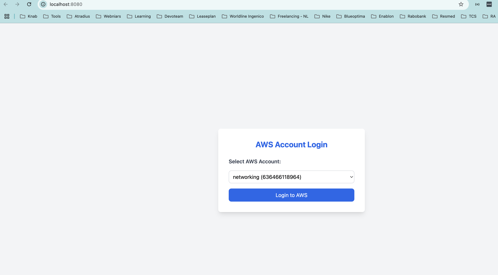

# aws-multiaccount-login
This repo contains flask application code which will facilitate us logging into our multiple aws accounts from a single portal and avoid using 3rd party sso solutions/tooling

TLDR: [For-short-read](./docs/readup.md)

## AWS Multi-Account Login Portal with IAM Role Switching, Without SSO

A simple Flask-based web application that allows users to seamlessly log into multiple AWS accounts by dynamically assuming IAM roles.

_🛠 What is this project?_

_Managing multiple AWS accounts can be challenging, especially when switching between different environments (production, staging, dev) or swithcing between multiple accounts(account A, account B and so on). This project provides a secure and automated way to log into various AWS accounts using IAM role switching instead of manually entering credentials._

_🔍 Why is this needed?_

* Avoid Managing Multiple AWS Access Keys – Instead of maintaining separate credentials for each AWS account, we use a single IAM user to assume roles dynamically.

* Secure Authentication – We eliminate the risk of hardcoding credentials across different systems.

* Efficient Access Management – Users can switch between AWS accounts via a simple web portal.

* Automated Role-Based Access – Based on predefined IAM roles, users can access the required AWS services.

_📌 Solution Considerations_

- Secure IAM Role Assumption – Uses sts:AssumeRole to generate temporary credentials.

- Minimal Access Keys – A single AWS IAM user is used to assume roles in multiple accounts.

- Dynamic Role Selection – Users select an AWS account from a dropdown, and the app automatically generates an AWS console login URL.

- Infrastructure as Code (IaC) Compatible – The role-based authentication setup aligns with best practices for multi-account AWS architectures.

- Web-Based UI – Built with Flask + HTML for a simple and effective user experience.

_ 🛠 Technology Stack_

| Component     | Technology                          |
|---------------|-------------------------------------|
| Backend       | Python + Flask                      |
| Frontend      | HTML + Tailwind CSS                 |
| AWS Services  | IAM, STS (Security Token Service)   |
| Database      | JSON-based configuration (aws_accounts.json) |
| Infrastructure| Docker (optional for deployment)    |

_🔹 Steps Involved_

***_1️⃣ IAM Role Configuration in AWS_***

1) Create an IAM user in the primary AWS account.

2) Assign the following policy to allow `sts:AssumeRole`:

```json
{
    "Version": "2012-10-17",
    "Statement": [
        {
            "Effect": "Allow",
            "Action": "sts:AssumeRole",
            "Resource": [
                "arn:aws:iam::123456789012:role/AWSConsoleAccessRole",
                "arn:aws:iam::987654321098:role/AWSConsoleAccessRole"
            ]
        }
    ]
}
```

3) Create an IAM role (AWSConsoleAccessRole) in each AWS account.

4) Edit the Trust Policy for each role to allow assumption by the IAM user.

***_2️⃣ Update aws_accounts.json with Account Details_***
1) This JSON file contains account names, IDs, and role names:

```json
[
    {
        "name": "networking",
        "account_id": "636466118964",
        "role_name": "Assumerole"
    },
    {
        "name": "cicd",
        "account_id": "367810454492",
        "role_name": "Assumerole"
    }
]
```

***_3️⃣ Running the Flask Application_***

1) Install dependencies:

```sh
pip install -r requirements.txt
```

2) Set AWS credentials:

```sh
export AWS_ACCESS_KEY_ID="your-access-key"
export AWS_SECRET_ACCESS_KEY="your-secret-key"
export AWS_DEFAULT_REGION="us-east-1"
```

3) Start the Flask app:

```sh
python login.py
```

4) Open in your browser:

```arduino
http://localhost:5000
```

***_4️⃣ Running Inside Docker (Optional)_***

1) Build the Docker image:

```sh
docker build -t aws-login-app .
```

2) Run the container:

```sh
docker run -p 5000:5000 aws-login-app
```

3) Access the UI via:

```arduino
http://localhost:5000
```

_🚀 How It Works_

- User selects an AWS account from the dropdown.

- Flask dynamically assumes the role using AWS STS.

- AWS returns temporary credentials, which are used to generate a sign-in URL.

- The user is redirected to the AWS Console without entering credentials.

_📸 UI Preview_

<p align="center">
  
</p>

_🛡️ Security Considerations_

✅ No Hardcoded AWS Credentials – Only IAM roles are used.

✅ Short-Lived Session Tokens – AWS STS generates temporary credentials.

✅ Least Privilege Principle – Each IAM role is restricted based on account policies.

_🌟 Conclusion_

This solution simplifies AWS multi-account access by leveraging IAM roles and STS for dynamic authentication. It reduces credential management overhead while ensuring secure and seamless login experiences.

## <font color = "red"> Follow-Me </font>

[](https://github.com/premkumar-palanichamy)

<p align="left">
<a href="https://linkedin.com/in/premkumarpalanichamy" target="blank"></a>
</p>

[](https://www.youtube.com/channel/UCJKEn6HeAxRNirDMBwFfi3w)